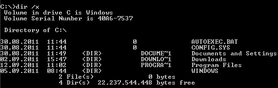

# U:69 - TFTP

## TFTP Client on Kali


```text
$ atftp

tftp> ?
Commands may be abbreviated.  Commands are:

connect         connect to remote tftp
mode            set file transfer mode
put             send file
get             receive file
quit            exit tftp
verbose         toggle verbose mode
trace           toggle packet tracing
status          show current status
binary          set mode to octet
ascii           set mode to netascii
rexmt           set per-packet retransmission timeout
timeout         set total retransmission timeout
?               print help information
```


### tftp-enum.nse

Nmap NSE script [`tftp-enum`](https://nmap.org/nsedoc/scripts/tftp-enum.html) makes use of `/usr/share/nmap/nselib/data/tftplist.txt` by default. We can customise the enum list to retrieve key files from the system.

```text
sudo nmap -sU -p 69 --script tftp-enum.nse --script-args tftp-enum.filelist=customlist.txt <host>
```


The `tftplist.txt` file also provides good insight into how enumeration is performed over TFTP. Note that you cannot get a file by specifying the full path, directory traversal is the only way.


Example:

```text
tftp> get "..\..\windows\system32\drivers\etc\hosts"
```


Note the quotes are necessary for file names that contains space \(although it works quite unreliably\) \(use atftp client may help\).

Alternatively, using notation 8.3 may help \(`dir /x`\).



A good wordlist for TFTP enumeration may come from LFI / path traversal lists.


#### Notation 8.3




### tftpbrute \(MSF\)

Wordlist: `/usr/share/metasploit-framework/data/wordlists/tftp.txt`

Usage: [https://www.offensive-security.com/metasploit-unleashed/scanner-tftp-auxiliary-modules/](https://www.offensive-security.com/metasploit-unleashed/scanner-tftp-auxiliary-modules/)

## TFTP Client on Windows

```text
tftp -i <ip>
```


